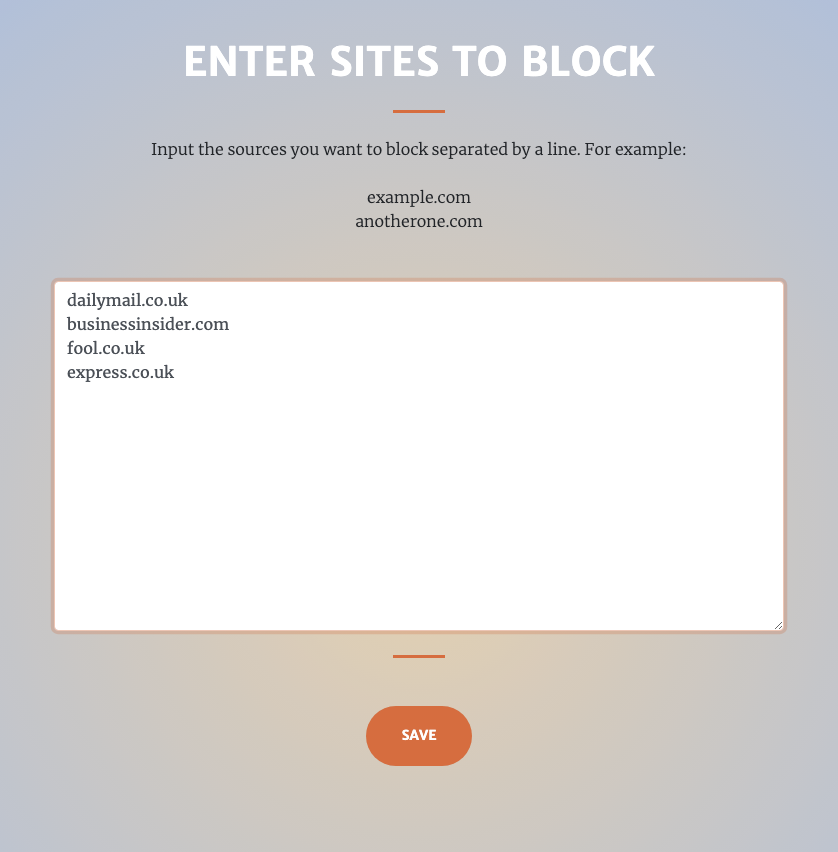

# Sauces


### Summary

Sauces is chrome extension which enables the user to prevent their specified sources from coming up in Google search results. 



### Installation

git clone https://github.com/ShaneLee/sauces.git

open chrome:://extensions

Turn developer mode on (see https://developer.chrome.com/extensions/getstarted)

Load unpacked (select the src folder)

### Run Tests

``` open test/SpecRunner.html ```


